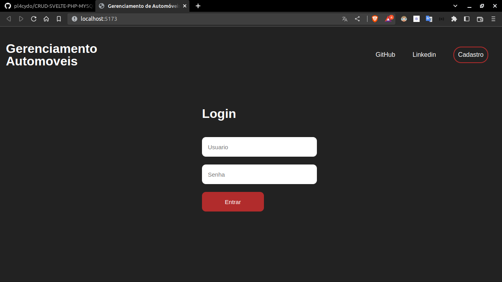
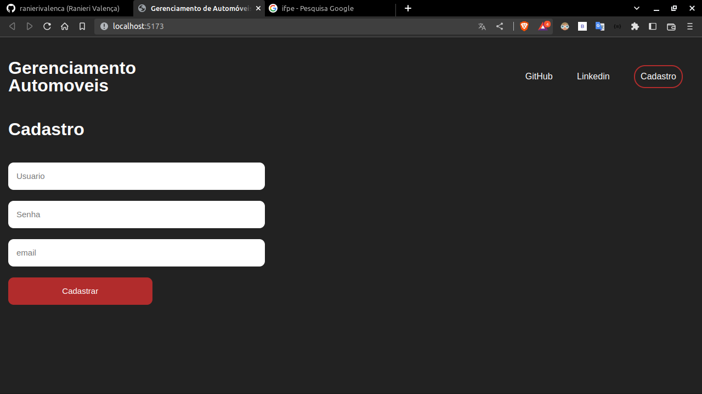
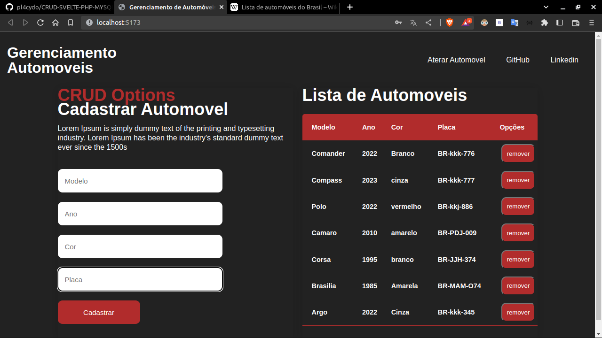
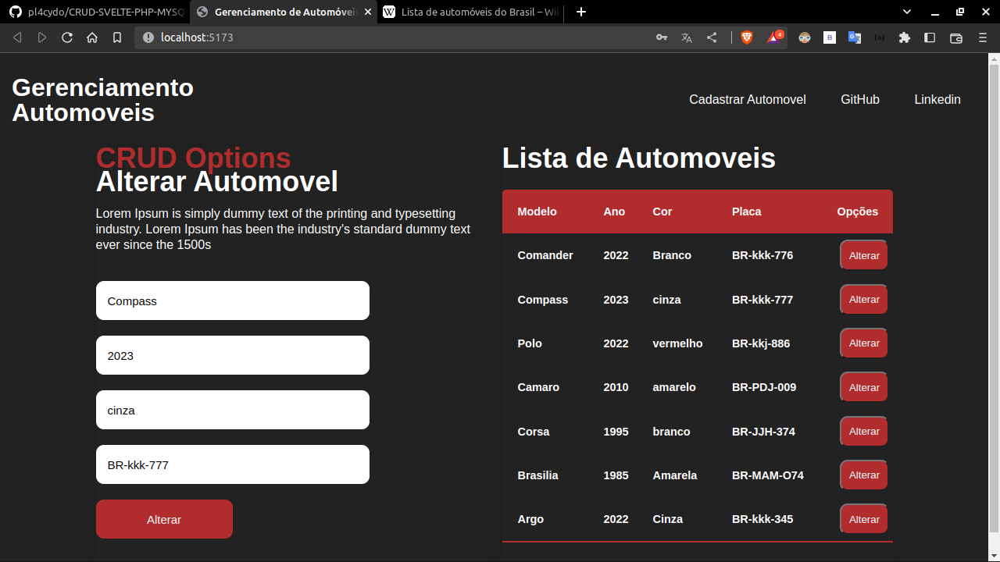

# CRUD cadastro de automóveis.

---

## Projeto de conclusão da cadeira de Desenvolvimento Web 1 no Curso Informática para Internet no Instituto Federal de Educação, Ciência e Tecnologia de Pernambuco.

Projeto com objetivo de criar um CRUD funcional usando SVELTE, PHP e MySQL.

Supervisionado pelo Docente [Ranieri Valença](https://github.com/ranierivalenca).

## Images
#### Tela Incial


#### Cadastro


#### Cadastro de Automoveis


#### Ateração



## Inciar o Projeto
*Para iniciar o Svelte você precisa ter o [nodejs](https://nodejs.org/en/) instalado.*

Siga os comandos a baixo para iniciar o front do jogo...

```bash
cd CRUD-SVELTE-PHP-MYSQL/front
npm install
```

...Para iniciar use o comando a baixo:

```bash
npm run dev
```

Navegue até o  [localhost:8080](http://localhost:8080). Nesse local você vera o projeto funcionando em faze de teste.

## Back
Para inciar o Backend.

*Você precisa ter o [PHP](https://www.php.net/downloads.php) e o [MySQL](https://www.mysql.com/downloads/) instalado.*

Para o back-end siga esses comados:

```bash
cd CRUD-SVELTE-PHP-MYSQL/back
php -S localhost:8001
```

*Também é importante entrar o arquivo de conexão e colocar o usuário e senha do seu cliente MySQL*

### MySQL
Para o MySQL no caminho a baixo você encontrara uma arquivo de script para a cração do banco
```bash
cd CRUD-SVELTE-PHP-MYSQL/Banco/banco.sql
```
Com isso banco ira fornecer um local para salvar o nome e os pontos do jogador.